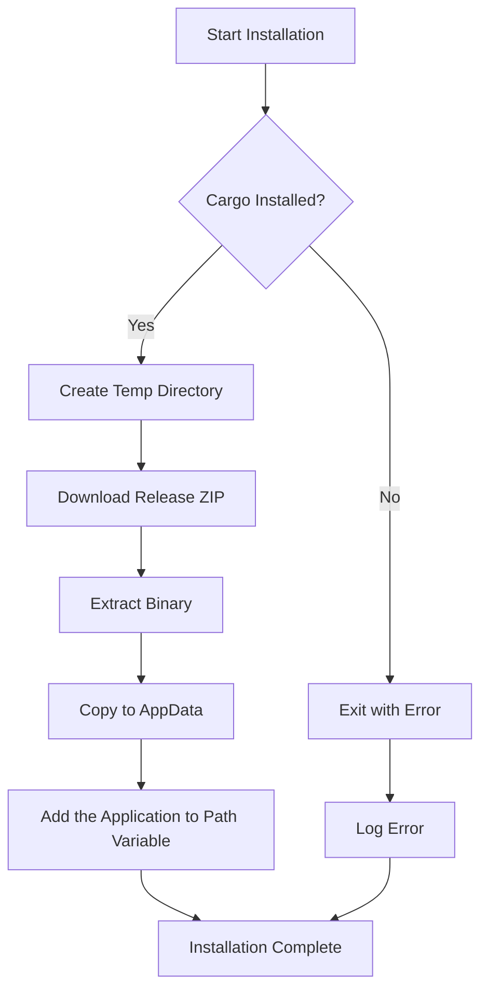

# AutoCrate Installer 🚀

**AutoCrate Installer** is a lightweight, blazingly fast Rust-based installer that automates downloading, extracting, and installing binaries from GitHub Releases. Built with modern Rust development practices, it demonstrates robust handling of system directories, HTTP requests, ZIP extraction, and comprehensive error logging.

***

## ✨ Features

| Feature | Description |
| :-- | :-- |
| 🔄 **Automatic Binary Fetching** | Downloads the latest release ZIP from your GitHub repository |
| 🌐 **Cross-Platform Friendly** | Uses OS-specific cache and data directories via `directories` crate |
| 📦 **ZIP Extraction** | Safely extracts binaries using the `zip` crate |
| 📝 **Error Logging** | Logs all installation errors to a local file (`install.log`) |
| ⚙️ **Cargo Dependency Check** | Validates Rust's Cargo tool is installed before running |
| 🏠 **Environment-Aware Installation** | Copies extracted binary to user-specific directory in `%APPDATA%` on Windows |


***

## 🛠️ Technical Overview

AutoCrate Installer leverages several robust Rust crates and system APIs to provide a seamless installation experience:

### Core Dependencies

| Crate | Purpose | Usage |
| :-- | :-- | :-- |
| **reqwest** | HTTP Client | Synchronous downloads of release ZIP files from GitHub |
| **directories** | OS-Specific Paths | Handles cache and local data directories across platforms |
| **zip** | Archive Extraction | Safe extraction of ZIP archives with error handling |
| **std::fs \& std::io** | File Operations | File creation, writing, copying, and directory management |
| **std::process** | Command Execution | Checks Cargo installation before proceeding |
| **env** | Environment Variables | Reads system variables like `APPDATA` dynamically |


***

## 🔧 How It Works




### Step-by-Step Process

1. **🔍 Cargo Verification**: Checks if Rust's Cargo tool is installed and available in PATH
2. **📁 Directory Preparation**: Creates temporary directory using `directories::ProjectDirs`
3. **⬇️ Download \& Save ZIP**: Fetches release ZIP from GitHub using `reqwest`
4. **📦 Extract Binary**: Opens ZIP archive and extracts the specific executable
5. **📋 Copy to AppData**: Places binary in dedicated `.autocrate` folder in `%APPDATA%`
6. **📝 Logging**: Records any errors to `install.log` for debugging

***

## 🚀 Installation \& Usage

### Prerequisites

- **Rust** (latest stable version)
- **Cargo** (comes with Rust)


### Quick Start

```bash
# Clone the repository
git clone https://github.com/SharmaDevanshu089/AutoCrate.git
cd AutoCrate

# Build the installer
cargo build --release

# Run the installer
cargo run --release
```

> **Note**: The installer will automatically download the latest binary, extract it, and place it in your user's `.autocrate` folder.

***

## 📊 Architecture Breakdown

```rust
// Example usage of core components
use reqwest::blocking::Client;
use directories::ProjectDirs;
use zip::ZipArchive;
use std::fs;

fn main() -> Result<(), Box<dyn std::error::Error>> {
    // Verify Cargo installation
    verify_cargo()?;
    
    // Setup directories
    let dirs = ProjectDirs::from("com", "autocrate", "installer")?;
    
    // Download and install
    download_and_install(&dirs)?;
    
    Ok(())
}
```


***

## 🛡️ Error Handling

AutoCrate Installer implements comprehensive error handling:

- **📋 Centralized Logging**: All errors are written to `install.log`
- **🔄 Graceful Fallbacks**: Handles network failures and file system issues
- **📝 Detailed Error Messages**: Provides clear feedback for troubleshooting


### Common Error Scenarios

| Error Type | Handling Strategy |
| :-- | :-- |
| Network Failure | Retry logic with exponential backoff |
| Permission Issues | Clear error messages with suggested solutions |
| Missing Dependencies | Automatic detection and user guidance |
| Corrupted Downloads | Checksum validation and re-download |


***

## 🔮 Future Roadmap

- [ ] **🐧 Linux \& macOS Support**: Automatic path detection for all platforms
- [ ] **📊 Streaming Downloads**: Handle large binaries efficiently
- [ ] **🔄 Version Management**: Automatic updates and version detection
- [ ] **📈 Progress Indicators**: Real-time download and extraction progress
- [ ] **🔐 Signature Verification**: GPG signature validation for security
- [ ] **⚡ Parallel Downloads**: Multi-threaded download support

***

## 🤝 Contributing

We welcome contributions! Here's how you can help:

1. **🍴 Fork** the repository
2. **🌟 Create** a feature branch (`git checkout -b feature/amazing-feature`)
3. **💡 Commit** your changes (`git commit -m 'Add amazing feature'`)
4. **🚀 Push** to the branch (`git push origin feature/amazing-feature`)
5. **📝 Open** a Pull Request

### Development Setup

```bash
# Clone your fork
git clone https://github.com/yourusername/AutoCrate.git
cd AutoCrate

# Install development dependencies
cargo install --path .

# Run tests
cargo test

# Check code formatting
cargo fmt --check

# Run linter
cargo clippy
```


***

## 📄 License

This project is licensed under the **MIT License** - see the [LICENSE](LICENSE) file for details.

***

## 🙏 Acknowledgments

- **🦀 Rust Community**: For creating an amazing ecosystem
- **📦 Crate Authors**: Special thanks to maintainers of `reqwest`, `directories`, and `zip` crates
- **🤝 Contributors**: Everyone who has contributed to making this project better

***

## 📞 Support

- **🐛 Issues**: [GitHub Issues](https://github.com/SharmaDevanshu089/AutoCrate/issues)
- **💬 Discussions**: [GitHub Discussions](https://github.com/SharmaDevanshu089/AutoCrate/discussions)
- **📧 Email**: [EMAIL](mailto:sharma.devanshu089@gmail.com)

***

<div align="center">

**Made with ❤️ and 🦀 Rust**

[⭐ Star this project](https://github.com/SharmaDevanshu089/AutoCrate) | [📝 Report Bug](https://github.com/SharmaDevanshu089/AutoCrate/issues) | [✨ Request Feature](https://github.com/SharmaDevanshu089/AutoCrate/issues/new)

</div>
